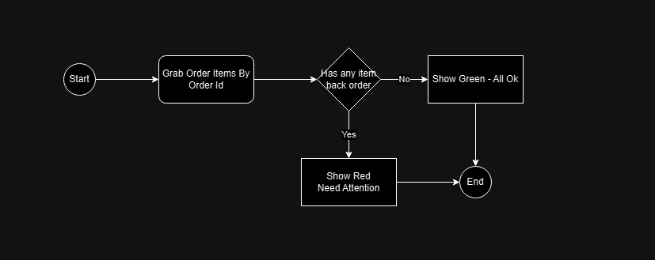
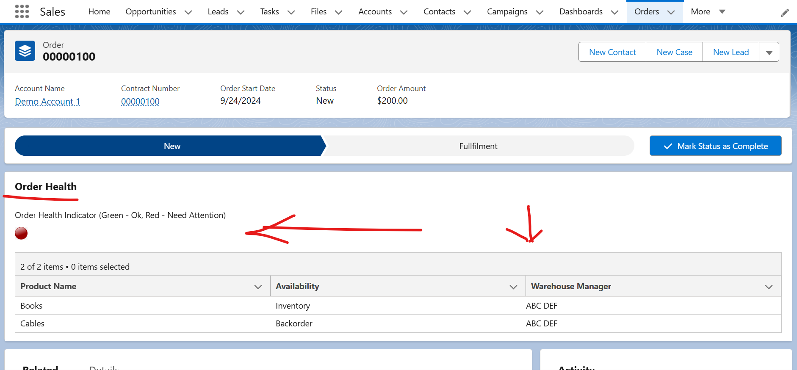

# Project Overview

John is an operations manager. He wants to ensure product availability information is populated on
an order by the service rep before the service rep can progress the order from the New stage to the
Fulfillment stage. John wants to capture the warehouse manager’s name who confirmed available
inventory and whether each of the products ordered is in inventory or backordered. Later, when John
views the Order, he wants to see backordered scenarios indicated with red highlights on the order
screen.

## Key Deliverable

- Operation Manager should be able to

  - See warehouse manager's details who confirmed inventory
  - See if product is available in inventory or backordered
  - See at order record screen with red highlight if order is back ordered

- Warehouse Manager should be able to

  - Specify product inventory detail (Available / Back order)

- Sales Rep should be able to
  - See on order screen if product is inventory or back order
  - should be able to change order stage

## Assumptions

    -   Warehouse manager provide inventory specific input at each product level

    -   Assuming that an order may have more than one product in it

    -   There is a process in place to receive / populate inventory details in system along with warehouse manager details (reference)

    -   Assuming if order is in inventory sales rep should be able to move it to fullfilment stage else not (if backorder)

    -   Assuming order is available in new stage for Sales Rep to review and decide if move it for next stage or not

    -   Assuming that on each order screen itself it is expected to understand order health

## High Level Workflow

### Demo

